# Groma Global Limited - Corporate Website Portal

This repository contains the complete, pixel-perfect replication of the **Groma Global Limited** corporate web portal, rebuilt from the ground up as a static website. It is designed to meet strict regulatory and compliance standards for an IPO-level public company.

---

## 🏢 About the Company
Established in 2006 and headquartered in Mumbai, India, **Groma Global Limited (GGL)** is a premier international trader, exporter, and processor of agricultural commodities. Over the past 19+ years, Groma Global has built a robust supply chain spanning India, Africa (Tanzania, Malawi), Canada, the Black Sea region, South America, and Southeast Asia. 

Groma Global specializes in sourcing and supplying high-quality:
* **Grains & Cereals** (Wheat, Barley, Rice, Corn, Millets)
* **Pulses & Legumes** (Lentils, Peas, Beans)
* **Oilseeds & Spices** (Sesame Seeds, Spices, Cashew Nuts)
* **Specialty Products** (Sugar, Animal Feed, and Certified Organic items)

---

## 🗺️ Site Structure Map

The portal is organized into five core pages, integrated with dynamic dropdown menus, hash-anchor routing, and a responsive slide-out drawer navigation for compliance panels.

```mermaid
graph TD
    A[index.html - Home] --> B[about.html - About Us]
    A --> C[products.html - Products]
    A --> D[investors.html - Investors]
    A --> E[contact.html - Contact Us]
    
    subgraph About Page Sections
        B --> B1[Company Profile]
        B --> B2[Mission & Vision]
        B --> B3[Our Services]
    end
    
    subgraph Products Categories
        C --> C1[Grains/Cereals]
        C --> C2[Pulses]
        C --> C3[Raw Cashew Nut]
        C --> C4[Organic]
        C --> C5[Sesame]
        C --> C6[Sugar & Spices]
    end
    
    subgraph Investor Relations Sub-tabs
        D --> D1[Promoters Message]
        D --> D2[Board of Directors]
        D --> D3[Committee Board]
        D --> D4[Financial Results]
        D --> D5[Shareholding Pattern]
        D --> D6[Corporate Policies]
        D --> D7[Annual Reports]
        D --> D8[Initial Public Offering - IPO]
        D --> D9[Investor Grievances]
        D --> D10[Material Documents & Contracts]
        D --> D11[Material Creditors]
    end
```



### 📂 File Directory & Architecture
* **[`index.html`](file:///c:/Users/Abhirup/Desktop/site/index.html)** — Portal landing page showcasing Groma's core business, corporate presence, and global country operations.
* **[`about.html`](file:///c:/Users/Abhirup/Desktop/site/about.html)** — Detailed company profile, founders' vision, mission statements ("Work is Worship"), and end-to-end logical supply chain service offerings.
* **[`products.html`](file:///c:/Users/Abhirup/Desktop/site/products.html)** — Detailed product index with sub-navigation links for easy categoric jumping, natural aspect ratio galleries, and vertical lists.
* **[`investors.html`](file:///c:/Users/Abhirup/Desktop/site/investors.html)** — Highly compliant interactive investor dashboard featuring promoters' messages, compliance officer contact points, financial records, and statutory IPO filing placeholders.
* **[`contact.html`](file:///c:/Users/Abhirup/Desktop/site/contact.html)** — Global presence overview, office address, contact numbers, email configurations, and interactive feedback form.
* **[`styles.css`](file:///c:/Users/Abhirup/Desktop/site/styles.css)** — Global styles containing responsive CSS Grid components, media query viewports, slide-out drawer transformations, and typography parameters.
* **[`script.js`](file:///c:/Users/Abhirup/Desktop/site/script.js)** — Dynamic DOM scripting handling mobile nav drawer expansion, mobile dropdown triggers, URL hash-based tab redirection, and interactive client feedback forms.
* **`images/`** — Local repository containing all 20+ optimized corporate graphics, country flags, company logo, and wheat backgrounds.

---

## ⚡ Technical Highlights

### 🔍 Search Engine Optimization (SEO)
The site incorporates semantic HTML5, highly descriptive titles, optimized `<meta name="description">` tags, canonical links, and Open Graph (OG) tags to facilitate proper indexing and presentation when shared:
* **Descriptive Titles**: Unique page titles optimized with brand names and descriptive keywords.
* **Canonical Headers**: Strict `<link rel="canonical">` configurations to avoid duplicate content penalties.
* **Open Graph Metadata**: Full `og:title`, `og:description`, `og:image`, and `og:url` integrations on all headers.
* **Accessibility & SEO Alignment**: Uses `.sr-only` utility tags to maintain a clean heading hierarchy (e.g., hidden `<h1>` on the Contact page) without affecting the premium visual design.

### 📱 Responsive Adaptability
* **Header Menus**: Dropdowns are hover-activated on desktop and toggle vertical dropdown lists on mobile clicks.
* **Investor Dashboard**: Sub-tabs display as a fixed left-aligned sticky navigation bar on desktop, and transform into a slide-out drawer with a darkened backdrop overlay on tablet/mobile viewports.
* **Image Fidelity**: Zero skewing. Images scale naturally according to their native aspect ratios using clean CSS containment (`width: 100%; height: auto;`).

---

## 🚀 Getting Started

### Running Locally
Since this is a lightweight, static client-side portal, you can run it without any build configurations:

1. **Direct Load**: Open `index.html` directly in any web browser.
2. **HTTP Server (Recommended)**: Serve via Python for complete relative path mapping:
   ```bash
   # Navigate to root directory
   cd site
   
   # Run simple HTTP server
   python -m http.server 8000
   ```
   Open **`http://localhost:8000`** in your browser.
